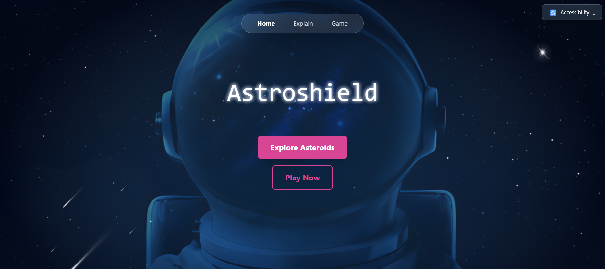
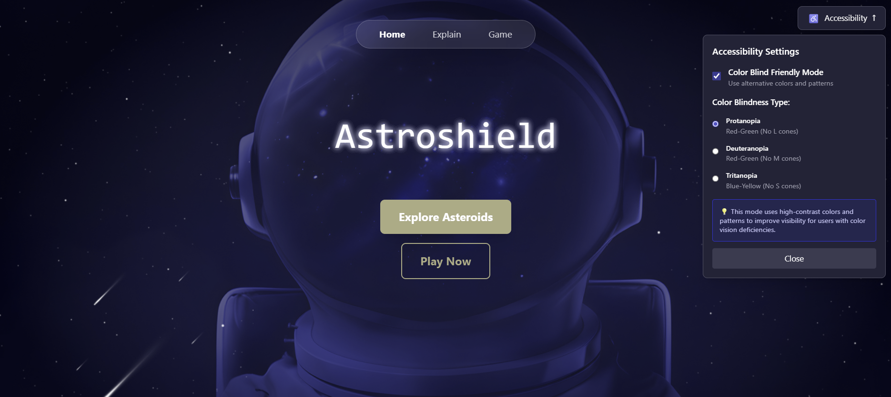
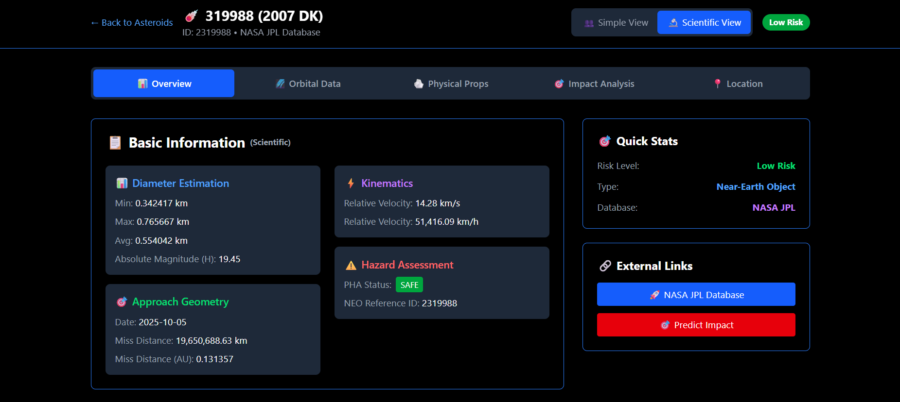
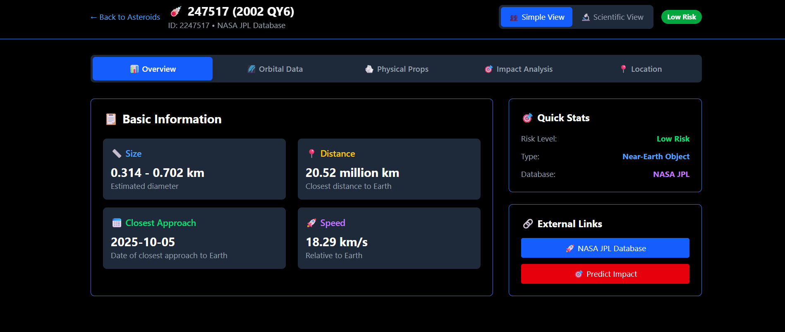
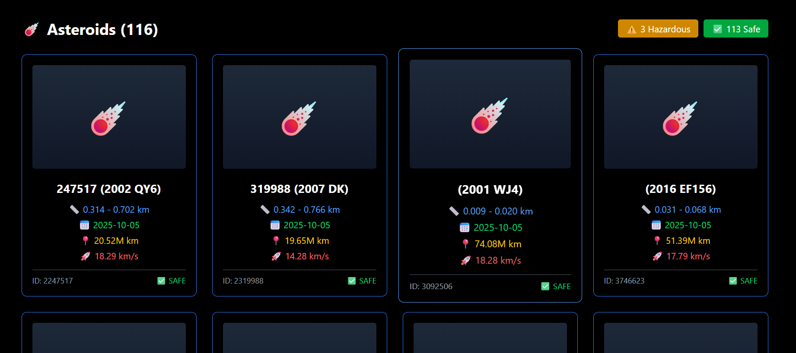
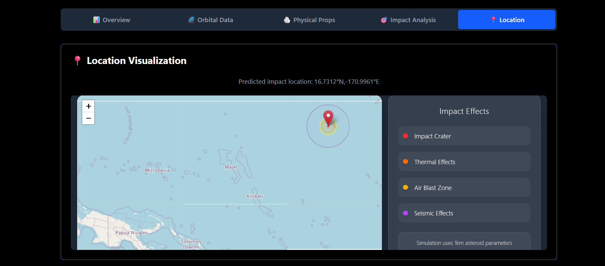
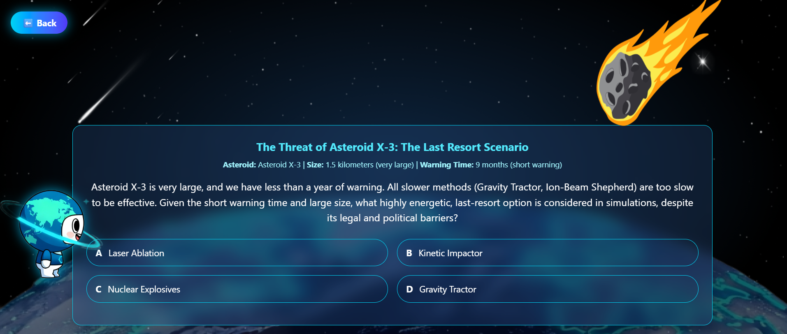

# AstroShield
## Advanced Asteroid Impact Simulation and Planetary Defense System
### NASA Space Apps Challenge 2025 - Project Documentation

---

## 1. HIGH-LEVEL PROJECT SUMMARY

### What We Developed:
AstroShield is a comprehensive asteroid impact simulation system combining real NASA data with advanced orbital mechanics. It features an interactive web application with world mapping and a sophisticated backend API powered by NASA's JPL Small-Body Database and other sources.



### How It Addresses the Challenge:
- **Real-Time Threat Assessment** using NASA's JPL Small-Body Database and NASA NeoWs Database
- **Advanced Impact Modeling** with proper Keplerian orbital mechanics
- **Interactive Visualization** with Leaflet maps for impact simulation
- **Comprehensive Risk Analysis** including damage radii and crater formation
- **Educational Outreach** on asteroid deflection methods through interactive gaming (Wiiry Boy character)

### Why It's Important:
Asteroid impacts pose genuine threats to Earth. AstroShield provides early warning capabilities, realistic impact assessment, public education tools, and a research platform for planetary defense studies.

---

## 2. PROJECT DETAILS

### Core Functionality:
✓ **Asteroid Data Integration** - Real-time NASA JPL Small-Body Database access and NASA NeoWs  
✓ **Trajectory Prediction** - Keplerian orbital mechanics implementation  
✓ **Impact Simulation** - Realistic scenarios with coordinates and velocities  
✓ **Risk Assessment** - Crater formation and damage analysis  
✓ **Interactive Mapping** - World map interface for impact visualization  
✓ **Educational Gaming** - Interactive learning through decision scenarios  
✓ **Expert mode and Simple View** for Asteroid data and analytics  
✓ **Color-blind friendly version** – Adjusts the colors of the website to allow inclusion of color blind people  



*As you can see, the colors of the website change to accommodate people who are color blind by changing the colors of the UI.*

### Dual View System



When assessing the asteroids, the website offers both a **simple view** and a **scientific view** (with the asteroid ID on top) to help both scientists and enthusiasts access the information in a way that fits them.

### Asteroid List Interface



The website displays the asteroids in a list to allow users to have an overview of the NEOs and clicking on them navigates you to the page which allows you to calculate the course of the asteroid, and the possible impact zone (if applicable).

### Interactive Educational Gaming



The game featuring our mascot **Wiiry** allows the user to learn about the methods of asteroid deflection by playing an interactive game.

### Technical Architecture:
- **Frontend**: React.js + Leaflet mapping + Tailwind CSS
- **Backend**: Flask API + Python scientific libraries
- **Database**: Direct NASA JPL API integration
- **Physics**: Custom Keplerian orbital mechanics engine
- **Modeling**: Scientific algorithms for impact assessment

### Benefits:
- **Scientific**: Accurate predictions using real NASA data
- **Educational**: Interactive learning about asteroid threats
- **Practical**: Early warning and disaster preparedness tools

### Development Tools:
- **Languages**: JavaScript/React, Python, HTML/CSS
- **Frameworks**: React.js, Flask, Leaflet, NumPy, Tailwind CSS
- **APIs**: NASA JPL Small-Body Database, OpenStreetMap
- **Environment**: VS Code, Node.js, Python 3.11, Git

---

## 3. NASA DATA USAGE



### Primary NASA Data Sources:

#### • NASA JPL Small-Body Database (SBDB)
- Physical properties (diameter, magnitude, albedo)
- Classification data (NEO status, PHA designation)
- Search functionality for asteroid discovery
- Real-time catalog access

#### • NASA NeoWs
- Querying near earth asteroids in a certain period
- Get asteroids by ID to be used by JPL

### Data Implementation:
- Direct API integration for live data access
- Real physics calculations using orbital elements
- Scientific accuracy through authentic observational data
- Educational value using genuine NASA information

### Data Processing:
- Convert orbital elements to 3D position vectors
- Calculate positions using Kepler's equation
- Predict trajectories with gravitational mechanics
- Assess close approach scenarios with Earth

---

## 4. SPACE AGENCY PARTNER & OTHER DATA SOURCES



- **OpenStreetMap** (Base mapping)
- **Collins et al. Impact Scaling Laws** (Crater size calculations)
- **USGS Earthquake Data** (Seismic modeling reference for comparison)

---

## 5. USE OF ARTIFICIAL INTELLIGENCE (AI)

### AI Tools Utilized:

#### • GitHub Copilot
- Code completion and development assistance
- Orbital mechanics calculation support
- API integration guidance
- Frontend component development
- Documentation generation assistance

### AI Applications:
✓ **Code Generation**: Boilerplate code for APIs and React components  
✓ **Algorithm Implementation**: Complex mathematical functions  
✓ **Error Debugging**: Integration issue resolution  
✓ **Documentation**: Structure and formatting assistance  

### Responsible AI Usage:
- All AI-generated code thoroughly reviewed and tested
- Scientific calculations validated against astronomical principles
- NASA data integration manually verified for accuracy
- Human oversight maintained for all critical decisions
- Transparent documentation of AI assistance

---

## 6. TECHNICAL IMPLEMENTATION HIGHLIGHTS

### Advanced Orbital Mechanics Engine
Our system implements sophisticated Keplerian orbital mechanics for accurate asteroid trajectory prediction:

```python
# Enhanced orbital mechanics with variable time steps
IMPACT_THRESHOLD_KM = 100000  # 100k km threshold
TIME_STEP_HOURS = 6  # 6-hour intervals for accuracy
FINE_TIME_STEP_HOURS = 1  # 1-hour intervals near close approach
```

### Real-Time Impact Assessment
- Variable time-step algorithms for computational efficiency
- Enhanced crater diameter calculations
- Realistic damage radius modeling
- Physics-based trajectory analysis

### Interactive User Interface
- Responsive design for all devices
- Accessibility features for color-blind users
- Simple and scientific view modes
- Real-time data visualization

---

## 7. PROJECT IMPACT & FUTURE DEVELOPMENT

### Educational Impact
AstroShield serves as a powerful educational tool, making complex astronomical concepts accessible through:
- Interactive gaming with the Wiiry character
- Dual-mode interfaces for different user levels
- Real-time NASA data integration
- Hands-on learning about planetary defense

### Scientific Contributions
- Advanced orbital mechanics implementation
- Real-time threat assessment capabilities
- Accurate impact modeling using authentic data
- Research platform for planetary defense studies

### Future Enhancements
- Machine learning for improved prediction accuracy
- Extended database integration (ESA, JAXA)
- Advanced visualization features
- Mobile application development
- Real-time alert system integration

---

## 8. CONCLUSION

AstroShield represents a significant advancement in asteroid impact simulation and planetary defense education. By combining cutting-edge technology with real NASA data, we've created a comprehensive platform that serves both scientific and educational communities.

Our system demonstrates the power of integrating authentic space agency data with modern web technologies to create tools that are both scientifically accurate and publicly accessible. The project showcases responsible AI usage, accessibility considerations, and the importance of making space science available to everyone.

Through AstroShield, we're not just simulating asteroid impacts – we're building awareness, fostering education, and contributing to humanity's collective effort to protect our planet from cosmic threats.

---

*NASA Space Apps Challenge 2025 - AstroShield Team*  
*Protecting Earth Through Science, Technology, and Education*